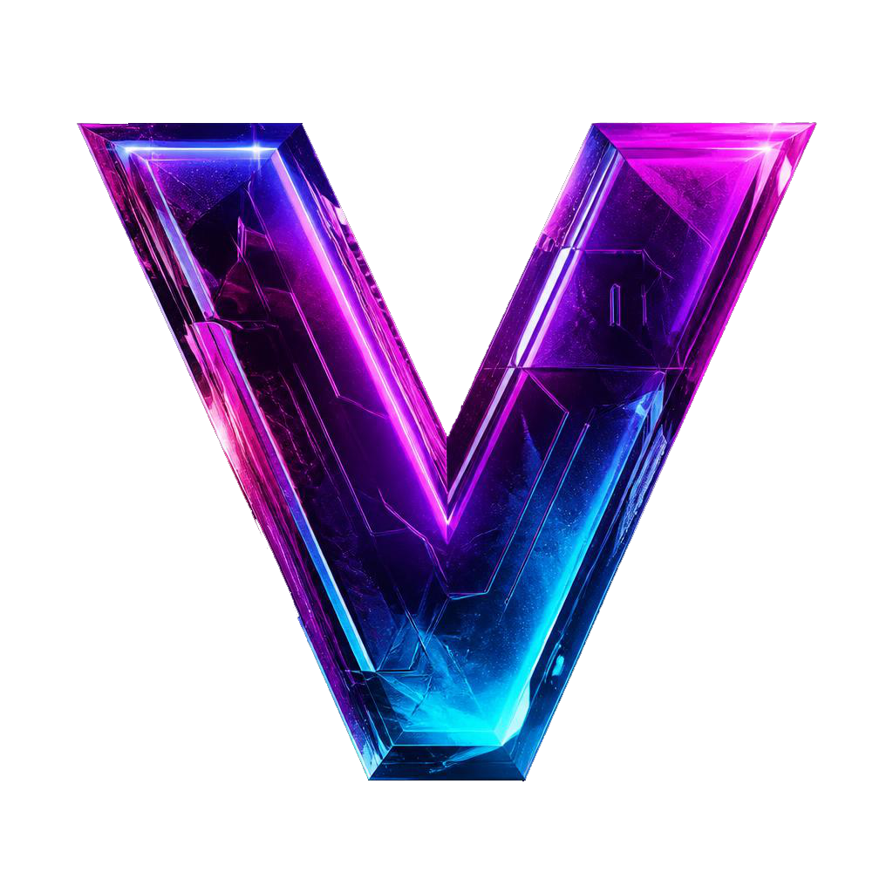

 

# _You know the vibes!_ 

⏵⏵ [Browse repository on GitHub](https://github.com/iamtew/vibes/) ⏴⏴

This repo contains a collection of various small web apps intended for use as OBS Browser Sources, background visuals, countdown screens, local previews, and such. 
They're called *vibes* because they give off a certain vibe. And there was some AI assisted coding involved as well, a.k.a. *Vibe Coding.* 

Enjoy!

## Usage

1. Open any link directly in a browser to preview the effect.
2. In OBS, add a new Browser Source and point it to the local HTML file path.
3. Set the source resolution to your target canvas size (for example, `1920x1080`).
4. Append query parameters to customize speed, colors, title text, and other visual options.
5. All rights are reserved for these files; use is at your own risk and there is no warranty from the author.

## Main Vibes

### [`browserinfo`](browserinfo/)
- Display browser details.
- Detect if running inside an OBS Browser Source.
- OBS detection functions made available to be included in other projects.

### [`spotsmoke`](spotsmoke/)
- Pick a spot on the screen and spawn a cloud of smoke there.
- Smoke characteristics full configurable.

## Individual Files

### [`coderain.html`](coderain.html)
- Chromatic code rain with Japanese characters and alphanumeric digits falling down the screen, creating an immersive digital atmosphere.
- Arguments: `?color=` (hex or named color), `?speed=`.

### [`field.html`](field.html)
- A geometric field effect with animated lines and soft motion, good for subtle ambient backgrounds.

### [`flower-of-life.html`](flower-of-life.html)
- A full-screen Flower of Life sacred-geometry animation with slow rotation and glowing circle intersections.

### [`flower-of-cyber.html`](flower-of-cyber.html)
- A cyber-inspired Flower of Life canvas animation with glowing lines and color customization.
- Arguments: `?color=` (hex), `?seconds=` for timing behavior.

### [`sacred.html`](sacred.html)
- A sacred geometry demo with a radial gradient, 25px grid overlay, inset frame, and selectable canvas animations.
- Arguments: `?color=` (hex), `?anim=` (`flower`, `fruit`, `metatron`), `?speed=`

### [`isogrid.html`](isogrid.html)
- An isometric ripple grid that feels like Douglas Adams designed geometry after tea.
- Arguments: `?color=#rrggbb` or `?color=rrggbb`, `?tileSize=` (16-256)

### [`gradient.html`](gradient.html)
- A pulsing radial gradient background that breathes light from the center outward.
- Arguments: `?color=` (hex or named color, e.g. `#00D9FF`).

### [`sinewaves.html`](sinewaves.html)
- Animated CRT-style sine wave field with scanlines and occasional glitch slices.
- Arguments: `?color=` (hex or named color).

### [`matrix.html`](matrix.html)
- Chromatic code rain with a soft glow, ideal for whenever your stream needs to feel just a little more ominous.
- Arguments: `?speed=`, `?color=` (hex values like `#64ff64`).

### [`pixel.html`](pixel.html)
- Pixel-art “Starting Soon” board with an animated grid and just enough retro swagger.

### [`pixel-fade-matrix.html`](pixel-fade-matrix.html)
- GPU‑friendly pixel‑block animation engine that generates evolving color‑wave patterns using mathematical phase fields rendered through an ImageData grid.
- Arguments: `?cellSize=`, `?pattern=`, `?speed=`, `?menu=`, `?color=`.

### [`spacetravel.html`](spacetravel.html)
- A drifting starfield for people who want to feel like they’re flying through space from the comfort of their desk.
- Arguments: `?colorSpeed=`, `?pixelated=`, `?dirt=`.

### [`spacetravel2.html`](spacetravel2.html)
- Full-screen starfield zoom through space with glowing moving stars.
- Arguments: `?speed=` (recommended range `0.1` to `1.2`).

### [`startingsoon.html`](startingsoon.html)
- Countdown timer page made for dramatic pauses, suspense, and theatrical “almost ready” vibes.
- Arguments: `?seconds=`, `?title=`.

### [`voroni2.html`](voroni2.html)
- A reactive Voronoi pulse‑field with evolving color palettes, procedural color mode, and edge‑driven glitch bursts that travel along cell boundaries. Includes a settings menu for live control of color, speed, density, glitch intensity, and palette behavior.
- Arguments: `?color=` (hex), `?palette=procedural`, `?speed=`, `?glitch=`, `?density=`, `?menu=ON|OFF|DISABLE`.

End Of File.